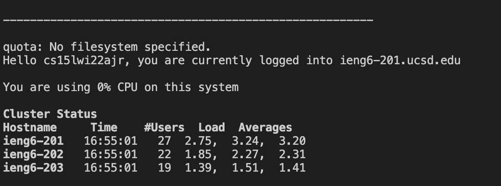

# CSE 15L Lab Report 1 #
# Kabir Bagai #

[Home](index.html)

**This is a tutorial for setting up VSCode, connecting to a remote server and running commands.**

**1. Installing VS Code**

Click on this [link](https://code.visualstudio.com/) to download VSCode for the appropriate type of operating system. When you've downloaded it sucessfully, the home screen should look something like this:

**2. Remotely Connecting**

Now, we will remotely connect to the ieng6 server in the CS Lab. Each student is issued a course specific account to do so. To find your account, visit: [https://sdacs.ucsd.edu/~icc/index.php](https://sdacs.ucsd.edu/~icc/index.php)

Once you have your account details (account name and password), 
copy the following command into the command line: 

`$ ssh cs15lwi22ajr@ieng6.ucsd.edu`

*Note that the account name is unique to me. Place your own account name before the `@ieng6.uscd.edu`. 

After this, the setup should start and look something like the picture below with some additional prompts if it's your first time. 

Note I have configured my ssh to not require a password, when yours starts, it will require you to enter the password associated with your account. 

**3. Trying Commands**

Next, try some different commands to navigate the filesystem. Here are some commonly used ones:

* `cd` - change directory
* `cd ~` - change to default directory
* `mkdir` - creates a new directory
* `li` - lists the contents of the directory
* `li -a` - lists the contents of the directory including hidden files
* `pwd` - prints working directory
* `cp` - copies files and directories

Here are examples of running some of these commands

To log out of the remote server, type the command `exit`

**4. Using `scp` to Copy Files Over SSH**

Now, we will copy a file on our computer to the remote server using the `scp` command. I used the WhereAmI.java file as an example. First compile and run this file on your computer using `javac` and `java` to make sure it works as expected. Then type the following command into the command line (replacing the account name with yours)

`scp WhereAmI.java cs15lwi22ajr@ieng6.ucsd.edu:~/`

After doing this, you will be prompted to enter your passcode. Then, ssh onto the remote server as usual and type in the command `ls`. If all went well, WhereAmI.java should appear in the list of files on ieng6. 

Here is an example of running the file and using scp to copy it 

Here is an example of listing the file and running it on the server

**5. Setting Up an SSH Key**

SSH keys are useful because they enable the user to not have to enter a password every time they wish to connect to the remote server. To set one up, type the command `ssh-keygen` to create a public/private key pair. Follow the prompts and note the locations of where the keys (`id_rsa.pub, id_rsa`) are stored. Then log on to the server and create a directory called .ssh using `mkdir`. Then log off and type the following command (using your account details) 

`scp /Users/kabirbagai/.ssh/id_rsa.pub cs15lwi22ajr@ieng6.ucsd.edu:~/.ssh/authorized_keys`

This copies the public key to the .ssh folder on the server. After doing this, you should be able to ssh and scp without a password. 

Logging in without a password

**6. Other Useful Tricks**
