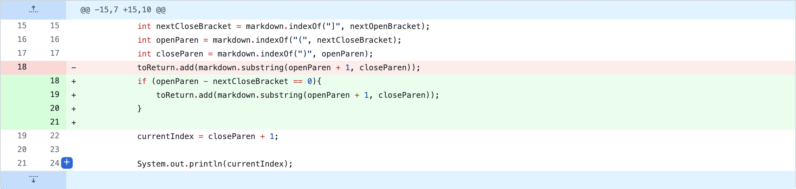

# CSE 15L Lab Report 2 #
# Kabir Bagai #

[Home](index.html)

**Code Change 1**

Assumes brackets are always immediately followed by parentheses for link in Markdown

Github

Failure inducing input

Symptom

The bug in the code caused files with text between a closed bracket and open parenthesis to be treated as links. The symptom of this is that text that isn't a link was being treated as one because it was contained in parentheses. 