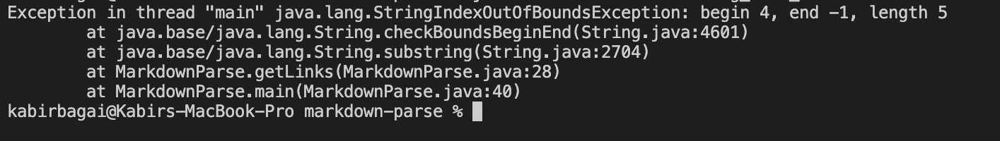

# CSE 15L Lab Report 2 #
# Kabir Bagai #

[Home](index.html)

***

**Code Change 1**

Fixes issue of brackets not immediately followed by parentheses

Github

[Failure Inducing Input](https://github.com/kabirbagai21/markdown-parse/blob/main/breaking_test.md)

Symptom

The bug in the code caused files with text between a closed bracket and open parenthesis (failure inducing inputs) to be treated as links. The symptom of this is that text that isn't a link was being treated as one because it was contained in parentheses. In the picture above, "toby maguire version" is being ouputted even though it isn't a link. The issue in the code that caused the bug was that the program wasn't checking if the bracket immediately followed the closed parentheses (i.e. the difference between their indicies is 1). 

***

**Code Change 2**

Fixes issue of infinite loop 

Github

[Failure Inducing Input](https://github.com/kabirbagai21/markdown-parse/blob/main/breakingtest1.md?plain=1)

Symptom

The bug in the code caused files with empty lines at the end of the document (failure inducing inputs) to fail when passed into MarkdownParse. The symptom of the bug was an infinite loop. One can see how currentIndex is printed over and over again in the above picture. The bug was caused by the absence of a break statement in the while loop in case another closed bracket could not be found (returns -1). 

***

**Code Change 3**

Fixes issue of no closed parenthesis

Github

[Failure Inducing Input](https://github.com/kabirbagai21/markdown-parse/blob/main/breaking_test_3.md)

Symptom

The bug in the code caused files with no closed parenthesis (failure inducing inputs) to fail when passed into MarkdownParse. The symptom of the bug was a index out of bounds exception because the program was unable to find the index of the next closed bracket.  