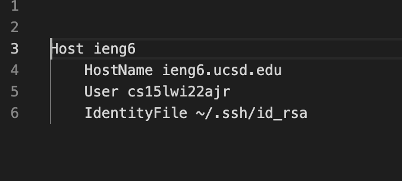
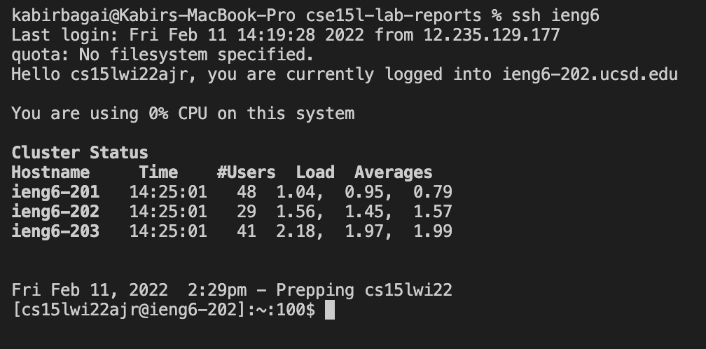
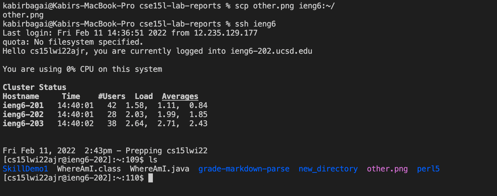

# CSE 15L Lab Report 3 #
# Kabir Bagai #

[Home](index.html)

***
**Config File**

This is the config file contained in the .ssh folder. It tells SSH what username to use when logging into a specific server- in this case, ieng6. It also includes my rsa key so I don't have to enter a password. 
***

**Logging in using ssh command**

This shows logging into the remote server using the updated commands. I simply have to input "ssh ieng6" and it logs into the server without requiring a password. This is because of the config file in the image above. 
***

**Using scp to copy files to remote server**

I copied a image from my cse15l-lab-reports directory to the ieng6 server using scp. Instead of typing out my entire username, all I had to do was replace it with "ieng6" and the file was copied. I then logged into ieng6, listed the files contained in my account and indeed, other.png was there. 