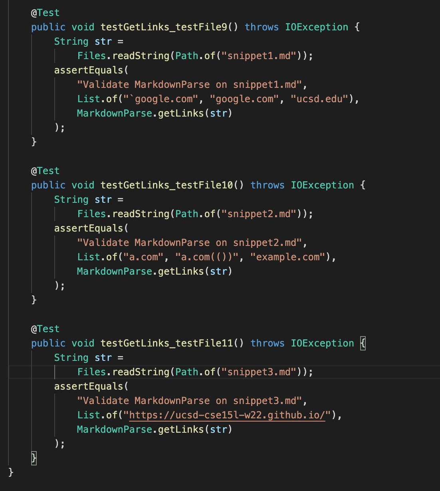
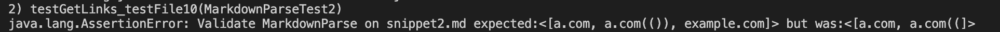

# CSE 15L Lab Report 3 #
# Kabir Bagai #

[Home](index.html)

***

[Link to my repository](https://github.com/kabirbagai21/markdown-parse)

[Link to other group's repository](https://github.com/IncogOwl/markdown-parse)

**Added Tests to MarkdownParseTest**

**Output for my tests (all three failed)**

***

***

**Output for other group's tests (all three failed)**

**Snippet 1**

I do think the fix to this bug require a more involved change because there are several different cases where backticks can and cannot be included as part of the markdown for links. Backticks should be allowed in the link itself (as is the case in the second link) as long as they are not preceeded by another backtick before the parentheses. Backticks should also be allowed within the link discriptions (like in the last two links). However, backticks within the brackets cannot be preceeded/proceeded by backticks outside the brackets as that would create a code block that messes up the formatting of the link (as is the case with the first link). All these cases would need to be considered when fixing this bug so it does require a more involved change. 

**Snippet 2**

These bugs can be solved by simple fixes. To fix the nested parentheses problem, we need to make sure all the parentheses within the link are paired up. Only update nextCloseParen if all parentheses within the link have pairs. A fix for the bracket problem could be to count a closed bracket as NextCloseBracket if and only if the character immediately following it is a open parenthesis. 

**Snippet 3**

I think fixing the first link in this snippet will require a more involved change as you'd have to write a function to detect linebreaks within the link description. Linebreaks should be allowed as long as they are not empty and continue the description as in the case of the second link. This function can also be used in the case of the third and fourth links to see if there are empty line breaks before the closing parenthesis. 