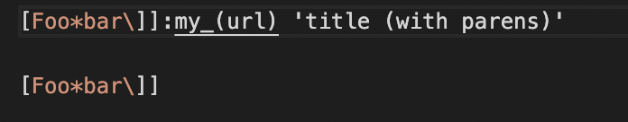
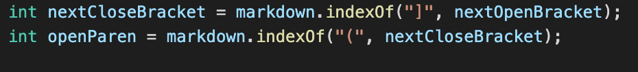
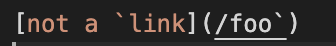
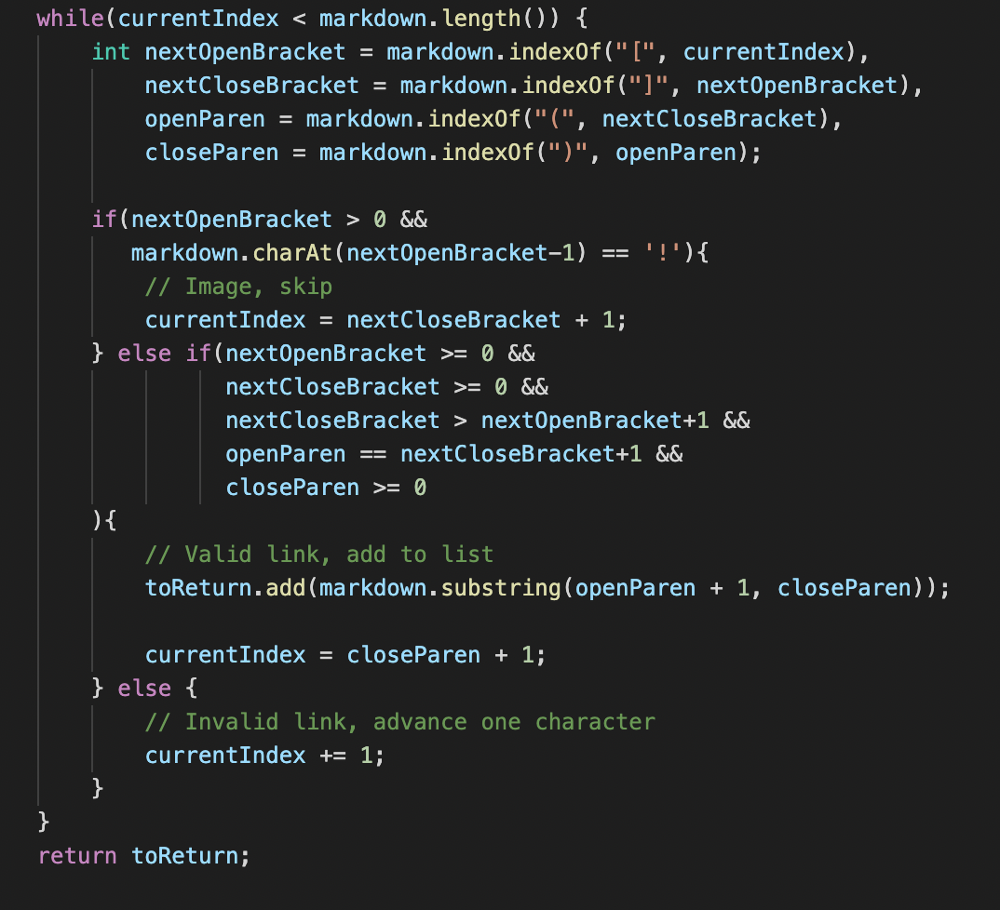

# CSE 15L Lab Report 5 #
# Kabir Bagai #

[Home](index.html)

***

To find the tests where the two implementations of MarkdownParse.java produced different results, I simply downloaded the results.txt file from Lab that had the output of running all the tests and compared them side by side. I found discrepancies in two tests, 194 and 342. 

**Test 194**

Input: 

Expected Output: []

My group's implementation output: []

Lab 9 implemenation output: [url]

In this case, our group's implementation is correct. In the test above, there are characters between the closed bracket and open parenthesis which makes it an invalid link. The Lab 9 implementation doesn’t check if a closed bracket is immediately followed by open paren, i.e. the difference between their character indices is 1. A simple if statement should fix this bug. 

 

Here is a snippet of code from the lab 9 implementation. A check should be added after these two statments to determine if the difference between the indicies is 1. 

**Test 342**

Input: 

Expected Output: []

My group's implementation output: [/foo`]

Lab 9 implementation output: [/foo`]

In this case, both implementations are wrong. This link uses \` which indicate code blocks in markdown. As such, the markdown reader outputs [not a `link](/foo`) instead of a link even though the rest of the formatting is valid. To fix this bug in my group's implemenation, we need to add a check to see if the link contains a pair of backticks between the link description and the link itself as is the case above.  
 

Here is a snippet of code from my group's implementation. A check should be added somewhere in the while loop to see if the link contains backticks. 